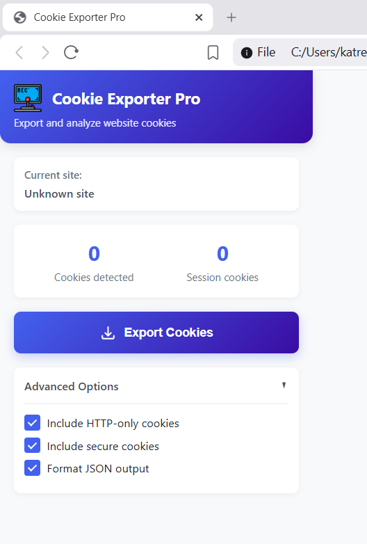
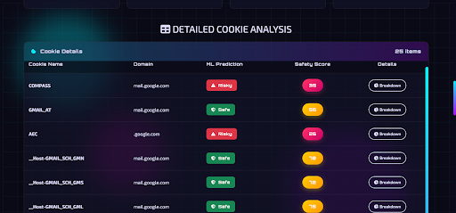
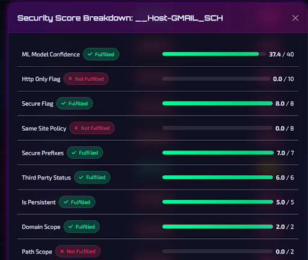
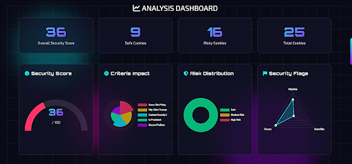

# 🔐 AI-Powered Cookie Security Analyzer

An advanced **AI + Cybersecurity tool** that analyzes browser cookies, detects privacy risks, and generates actionable security insights using a hybrid **Machine Learning + Rule-Based system**.

---

## 🚀 Features

- 🔍 Extract cookies from websites using a Chrome Extension  
- 🤖 AI-based risk detection using CatBoost ML model  
- 🧠 NLP embeddings using Sentence Transformers  
- ⚖️ Hybrid scoring system (ML + security rules)  
- 📊 Interactive dashboard with charts & insights  
- 📄 Automated PDF report generation  
- 🔐 Security checks: HttpOnly, Secure, SameSite, CSP, HSTS  

---

## 🏗️ System Architecture

Chrome Extension → JSON Export → Flask Backend → ML Model → Risk Analysis → Dashboard + PDF Report

---

## 🛠️ Tech Stack

### Frontend
- HTML, CSS, JavaScript  
- Chart.js  

### Backend
- Python, Flask  

### Machine Learning
- CatBoost Classifier  
- Sentence Transformers  

### Tools & Libraries
- Chrome Extensions API  
- ReportLab (PDF generation)  

---

## ⚙️ How It Works

1. Use the Chrome Extension to extract cookies from any website  
2. Export the data as a JSON file  
3. Upload the file to the analyzer dashboard  
4. The system:
   - Processes cookie data  
   - Applies ML model for classification  
   - Calculates security scores  
5. View results and download a detailed PDF report  

---

## 📊 Output Includes

- Cookie Risk Classification (Safe / Risky)  
- Security Score (0–100)  
- Risk Breakdown  
- Data Visualization (charts & stats)  
- Security Recommendations  

---

## 📸 Screenshots

 
- 
-   
- 

